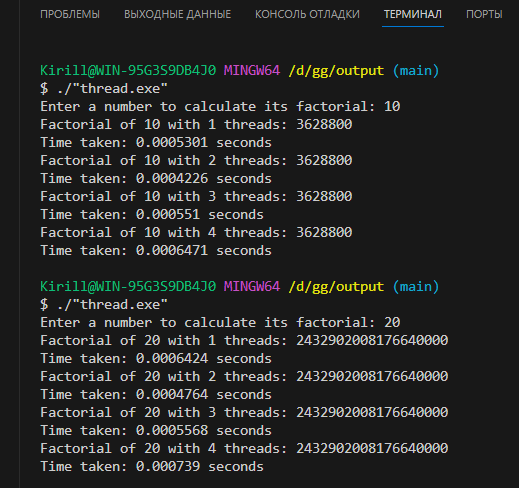

## Вычисление факториала с использованием потоков

Данная программа представляет собой пример вычисления факториала числа с использованием многопоточности в C++. Факториал числа n вычисляется с помощью функции `Factorial`, которая принимает целочисленный аргумент и возвращает значение факториала в виде `unsigned long long`. Для распараллеливания вычислений программа использует несколько потоков, каждый из которых вычисляет факториал числа n. Используется стандартная библиотека C++ `<thread>` для работы с потоками и `<chrono>` для измерения времени выполнения.

Программа запрашивает у пользователя ввод числа, для которого будет вычисляться факториал, а затем вызывает функцию `threadFactorial` с разным количеством потоков (1, 2, 3, 4) для вычисления факториала числа n параллельно. Результаты вычислений и время выполнения каждой операции выводятся на экран.

Скомпилировать программу можно с помощью команды `g++ -std=c++11 -pthread filename.cpp -o output`, где `filename.cpp` - имя файла с программой. После компиляции запустите программу и введите число, для которого хотите вычислить факториал, чтобы увидеть результаты и время выполнения с разным количеством потоков.

### Вот пример выполнения работы программы:

По результату видно что 2 потока выполняют работы быстрее чем остальные варианты. Возможно при использовании двух потоков достигается оптимальное сочетания параллелизма и позволяет избежать излишних накладных расходов, связанных с созданием и управлением большего количества потоков.
